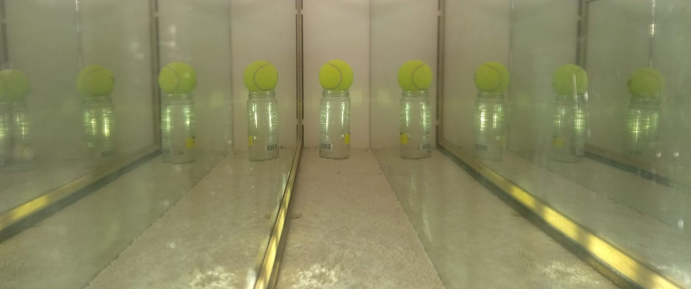

# Mirror Box Interactive

###Interactive Variables
- Click the hexagons to emit a pulse of light
- Drag the viewer to adjust its position
- Drag the mirrors to adjust their position

###Future Features
Users should be slowly introduced to each concept by building up layers of abstraction. The least abstract view that can be displayed on the screen is an image of the mirrors like the one below. Ideally this should be interactive and the 3d view should change with the 2d view.

Users should be able to: 
- Play time in reverse to see where a particle of light comes from
- Turn on and off coloring